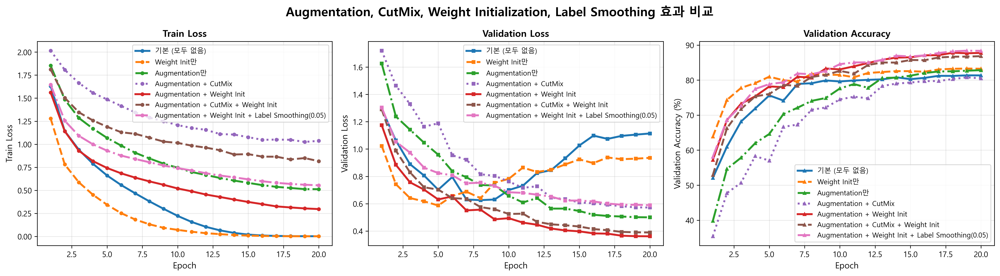
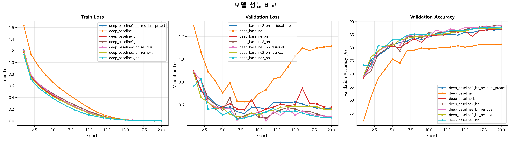

# 시도
`uv run main.py --optimizer adam --epochs 20 --lr 3e-4 --scheduler cosineannealinglr --net deep_baseline --augment --cutmix --w-init`
deep_baseline 모델을 기본으로 --augment, --cutmix, -w-init 조합 비교

## 모델 비교 시에 사용하는 기본 설정
Optimizer: Adam
Epochs: 20
Learning Rate: 3e-4
Scheduler: Cosine Annealing LR
Net: deep_baseline

## Augmentation, CutMix, Weight Initialization, Label Smoothing 효과 비교 20 Epoch 기준
기본 모델: deep_baseline

| 설정 | Augmentation | CutMix | Weight Init | Label Smoothing | 최고 Val Accuracy (%) |
|------|--------------|--------|-------------|-----------------|----------------------|
| 기본 (모두 없음) | ❌ | ❌ | ❌ | ❌ | 81.35 |
| Weight Init만 | ❌ | ❌ | ✅ | ❌ | 83.29 |
| Augmentation만 | ✅ | ❌ | ❌ | ❌ | 82.84 |
| Augmentation + CutMix | ✅ | ✅ | ❌ | ❌ | 80.79 |
| Augmentation + Weight Init | ✅ | ❌ | ✅ | ❌ | 87.81 |
| Augmentation + Weight Init + Label Smoothing(0.05) | ✅ | ❌ | ✅ | ✅ (0.05) | **88.39** |
| Augmentation + CutMix + Weight Init | ✅ | ✅ | ✅ | ❌ | 86.83 |

<small>명령어 보기</small>

- 기본 (모두 없음): `uv run main.py --optimizer adam --epochs 20 --lr 3e-4 --scheduler cosineannealinglr --net deep_baseline`
- Weight Init만: `uv run main.py --optimizer adam --epochs 20 --lr 3e-4 --scheduler cosineannealinglr --net deep_baseline --w-init`
- Augmentation만: `uv run main.py --optimizer adam --epochs 20 --lr 3e-4 --scheduler cosineannealinglr --net deep_baseline --augment`
- Augmentation + CutMix: `uv run main.py --optimizer adam --epochs 20 --lr 3e-4 --scheduler cosineannealinglr --net deep_baseline --augment --cutmix`
- Augmentation + Weight Init: `uv run main.py --optimizer adam --epochs 20 --lr 3e-4 --scheduler cosineannealinglr --net deep_baseline --augment --w-init`
- Augmentation + Weight Init + Label Smoothing(0.05): `uv run main.py --optimizer adam --epochs 20 --lr 3e-4 --scheduler cosineannealinglr --net deep_baseline --augment --w-init --label-smoothing 0.05`
- Augmentation + CutMix + Weight Init: `uv run main.py --optimizer adam --epochs 20 --lr 3e-4 --scheduler cosineannealinglr --net deep_baseline --augment --cutmix --w-init`

**결과 요약:**
- 최고 성능: Augmentation + Weight Init + Label Smoothing(0.05) = **88.39%**
- Weight Initialization만 추가해도 기본 대비 +1.94%p 향상
- Augmentation + Weight Init 조합이 가장 효과적 (87.81%)
- Label Smoothing(0.05) 추가 시 추가 +0.58%p 향상
- CutMix는 이 실험에서 오히려 성능을 약간 저하시킴 (Augmentation만: 82.84% vs Augmentation + CutMix: 80.79%)

## 모델 아키텍처 비교 20 Epoch 기준

| 모델 | Batch Normalization | Residual Connection | Pre-activation | 최고 Val Accuracy (%) |
|------|---------------------|---------------------|----------------|----------------------|
| deep_baseline | ❌ | ❌ | ❌ | 81.35 |
| deep_baseline_bn | ✅ | ❌ | ❌ | 87.21 |
| deep_baseline2_bn | ✅ | ❌ | ❌ | 88.41 |
| deep_baseline2_bn_residual | ✅ | ✅ | ❌ | **88.47** |
| deep_baseline2_bn_residual_preact | ✅ | ✅ | ✅ | 87.07 |
| deep_baseline2_bn_resnext | ✅ | ✅ | ❌ | 87.53 |
| deep_baseline3_bn | ✅ | ❌ | ❌ | 87.9 |

<small>명령어 보기</small>

- deep_baseline: `uv run main.py --optimizer adam --epochs 20 --lr 3e-4 --scheduler cosineannealinglr --net deep_baseline`
- deep_baseline_bn: `uv run main.py --optimizer adam --epochs 20 --lr 3e-4 --scheduler cosineannealinglr --net deep_baseline_bn`
- deep_baseline2_bn: `uv run main.py --optimizer adam --epochs 20 --lr 3e-4 --scheduler cosineannealinglr --net deep_baseline2_bn`
- deep_baseline2_bn_residual: `uv run main.py --optimizer adam --epochs 20 --lr 3e-4 --scheduler cosineannealinglr --net deep_baseline2_bn_residual`
- deep_baseline2_bn_residual_preact: `uv run main.py --optimizer adam --epochs 20 --lr 3e-4 --scheduler cosineannealinglr --net deep_baseline2_bn_residual_preact`
- deep_baseline2_bn_resnext: `uv run main.py --optimizer adam --epochs 20 --lr 3e-4 --scheduler cosineannealinglr --net deep_baseline2_bn_resnext`
- deep_baseline3_bn: `uv run main.py --optimizer adam --epochs 20 --lr 3e-4 --scheduler cosineannealinglr --net deep_baseline3_bn`

**결과 요약:**
- 최고 성능: deep_baseline2_bn_residual = **88.47%**
- Batch Normalization 추가 시 기본 대비 +5.86%p 향상 (deep_baseline_bn: 87.21%)
- deep_baseline2_bn이 deep_baseline_bn보다 +1.2%p 향상 (88.41% vs 87.21%)
- Residual connection 추가 시 추가 +0.06%p 향상 (deep_baseline2_bn_residual: 88.47%)
- Pre-activation residual은 이 실험에서 성능이 약간 저하됨 (87.07% vs 88.47%)
- deep_baseline2_bn_resnext (ResNeXt 구조)는 87.53%로 deep_baseline2_bn_residual_preact (87.07%)보다 약간 높은 성능
- deep_baseline3_bn은 deep_baseline2_bn보다 약간 낮은 성능 (87.9% vs 88.41%)

## 모델별 최고 성능 조합 20 Epoch 기준

| 모델 | Augmentation | CutMix | Weight Init | Label Smoothing | 최고 Val Accuracy (%) |
|------|--------------|--------|-------------|-----------------|----------------------|
| deep_baseline2_bn_residual | ✅ | ✅ | ✅ | ❌ | 90.4 |
| deep_baseline2_bn_residual_preact | ✅ | ❌ | ✅ | ❌ | **90.84** |
| deep_baseline2_bn_residual_preact | ✅ | ✅ | ✅ | ❌ | 90.02 |

<small>명령어 보기</small>

- deep_baseline2_bn_residual (Augmentation + CutMix + Weight Init): `uv run main.py --optimizer adam --epochs 20 --lr 3e-4 --scheduler cosineannealinglr --net deep_baseline2_bn_residual --augment --cutmix --w-init`
- deep_baseline2_bn_residual_preact (Augmentation + Weight Init): `uv run main.py --optimizer adam --epochs 20 --lr 3e-4 --scheduler cosineannealinglr --net deep_baseline2_bn_residual_preact --augment --w-init`
- deep_baseline2_bn_residual_preact (Augmentation + CutMix + Weight Init): `uv run main.py --optimizer adam --epochs 20 --lr 3e-4 --scheduler cosineannealinglr --net deep_baseline2_bn_residual_preact --augment --cutmix --w-init`

**결과 요약:**
- 최고 성능: deep_baseline2_bn_residual_preact (Augmentation + Weight Init) = **90.84%**
- deep_baseline2_bn_residual_preact 모델에 Augmentation + Weight Init을 적용한 결과: **90.84%**
- 기본 deep_baseline2_bn_residual_preact (87.07%) 대비 +3.77%p 향상
- deep_baseline2_bn_residual (Augmentation + CutMix + Weight Init, 90.4%)보다 +0.44%p 향상
- deep_baseline2_bn_residual_preact (Augmentation + CutMix + Weight Init) = 90.02%
  - Augmentation + Weight Init (90.84%)보다 -0.82%p 낮음
  - CutMix 추가 시 성능이 약간 저하됨
- Pre-activation residual 모델이 Augmentation + Weight Init 조합에서 최고 성능 달성
- 모든 실험 중 최고 성능 달성

## 100 Epoch 기준 실험 결과

| 모델 | Optimizer | Learning Rate | Batch Size | Augmentation | CutMix | Weight Init | Label Smoothing | Scheduler | 최고 Val Accuracy (%) |
|------|------|-----------|---------------|------------|--------------|--------|-------------|-----------------|-----------|----------------------|
| deep_baseline_bn | Adam | 0.001 | 128 | ✅ | ✅ | ✅ | ✅ (0.05) | CosineAnnealingLR | 91.99 |
| deep_baseline2_bn | Adam | 0.001 | 128 | ✅ | ✅ | ✅ | ✅ (0.05) | CosineAnnealingLR | **92.51** |
| deep_baseline2_bn_residual | Adam | 0.001 | 128 | ❌ | ❌ | ✅ | ❌ | CosineAnnealingLR | 대기 |
| deep_baseline2_bn_residual | Adam | 0.001 | 128 | ✅ | ✅ | ✅ | ✅ (0.05) | CosineAnnealingLR | 대기 |
| deep_baseline2_bn_residual_se | Adam | 0.001 | 128 | ❌ | ❌ | ✅ | ❌ | CosineAnnealingLR | 대기 |
| deep_baseline2_bn_residual_se | Adam | 0.001 | 128 | ✅ | ✅ | ✅ | ✅ (0.05) | CosineAnnealingLR | 대기 |
| deep_baseline2_bn_residual_preact | Adam | 0.001 | 128 | ❌ | ❌ | ✅ | ❌ | CosineAnnealingLR | 87.36 |
| deep_baseline2_bn_residual_preact | Adam | 0.001 | 128 | ✅ | ✅ | ✅ | ✅ (0.05) | CosineAnnealingLR | 진행 중 |
| deep_baseline2_bn_resnext | Adam | 0.001 | 128 | ❌ | ❌ | ✅ | ❌ | CosineAnnealingLR | 85.46 |
| deep_baseline2_bn_resnext | Adam | 0.001 | 128 | ✅ | ✅ | ✅ | ✅ (0.05) | CosineAnnealingLR | **92.97** |
| deep_baseline3_bn | Adam | 0.001 | 128 | ✅ | ✅ | ✅ | ✅ (0.05) | CosineAnnealingLR | 대기 |

<small>명령어 보기</small>

- deep_baseline_bn: `uv run main.py --optimizer adam --epochs 100 --lr 0.001 --batch-size 128 --scheduler cosineannealinglr --net deep_baseline_bn --augment --cutmix --w-init --label-smoothing 0.05`
- deep_baseline2_bn: `uv run main.py --optimizer adam --epochs 100 --lr 0.001 --batch-size 128 --scheduler cosineannealinglr --net deep_baseline2_bn --w-init --augment --cutmix --label-smoothing 0.05`
- deep_baseline2_bn_resnext: `uv run main.py --optimizer adam --epochs 100 --lr 0.001 --batch-size 128 --scheduler cosineannealinglr --net deep_baseline2_bn_resnext --w-init`
- deep_baseline2_bn_residual: `uv run main.py --optimizer adam --epochs 100 --lr 0.001 --batch-size 128 --scheduler cosineannealinglr --net deep_baseline2_bn_residual --w-init`
- deep_baseline2_bn_residual_preact: `uv run main.py --optimizer adam --epochs 100 --lr 0.001 --batch-size 128 --scheduler cosineannealinglr --net deep_baseline2_bn_residual_preact --w-init`
- deep_baseline3_bn: `uv run main.py --optimizer adam --epochs 100 --lr 0.001 --batch-size 128 --scheduler cosineannealinglr --net deep_baseline3_bn --w-init --augment --cutmix --label-smoothing 0.05`

- deep_baseline2_bn_resnext: `uv run main.py --optimizer adam --epochs 100 --lr 0.001 --batch-size 128 --scheduler cosineannealinglr --net deep_baseline2_bn_resnext --w-init --augment --cutmix --label-smoothing 0.05`

**하이퍼파라미터:**
- Epochs: 100
- Optimizer: Adam
- Learning Rate: 0.001
- Batch Size: 128
- Momentum: 0.9
- Scheduler: CosineAnnealingLR (T_max: 100, eta_min: 0.0)
- Label Smoothing: 0.05
- Data Augmentation: ✅
- CutMix: ✅
- Weight Initialization: ✅
- Seed: 42

**결과 요약:**
- 최고 성능: **91.99%** (100 에포크)
- 20 에포크 기준 최고 성능 (88.39%) 대비 +3.60%p 향상
- Augmentation + CutMix + Weight Init + Label Smoothing 조합으로 최고 성능 달성
- 100 에포크까지 학습하여 모델의 최대 성능 확인

